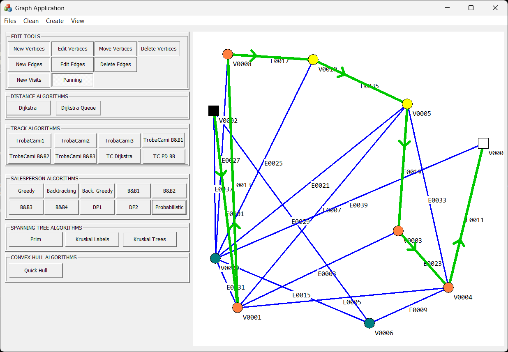

# ADA_SalesmanProblem
Repository containing the project realized in the subject ADA (Analysis and Design of Algorithms). It includes the `GraphApplication` project (MFC desktop app) and helper projects such as the `JPEGLib` static library (libjpeg source) used by the app for JPEG handling. All the content except these files below were created by professor Francisco Javier Sánchez Pujadas.

 
[Dijkstra.cpp](GraphApplication/Dijkstra.cpp)
[Greedy.cpp](GraphApplication/Greedy.cpp)
[Backtracking.cpp](GraphApplication/Backtracking.cpp)
[BranchAndBound.cpp](GraphApplication/BranchAndBound.cpp)
[Probabilistic.cpp](GraphApplication/Probabilistic.cpp) 
All algorithms are explained below

Overview
--------
- `JPEGLib/` - libjpeg (libjpeg-turbo) source integrated as a Visual Studio project build (static library).
- `GraphApplication/` - the main MFC application that uses `JPEGLib` and provides algorithm visualizations.

Prerequisites
-------------
- Windows 10/11
- Visual Studio 2022 (recommended) with these components:
	- Desktop development with C++ workload
	- MFC/ATL support
	- Windows 10 SDK
	- MSVC Platform Toolset v143

Build instructions
------------------
Visual Studio:

1. Open `GraphApplication.sln` in Visual Studio.
2. Confirm both `JPEGLib` and `GraphApplication` are visible in Solution Explorer.
3. (Recommended) Add a project reference (GraphApplication → right-click → Add → Reference → Projects → check `JPEGLib`) so Visual Studio automatically builds the library and links to it.
4. Choose the configuration (e.g., Debug|x64 or Debug|Win32).
5. Build → Rebuild Solution.
6. Run the application or locate the generated executable at a path similar to `x64/Debug/GraphApplication.exe`.

How to use
----------------
Loading a graph and visits:
- Files -> Load Graph -> Navigate to TestSalesMan and choose
- Files -> Load Visits -> Navigate to TestSalesMan and load the visit corresponding to the Graph you choose

_Black square:_ start. 
_White square:_ finish. 
_Orange circles:_ Visits the path has to go through. 

To see the algorithms implemented click the corresponding button, currently available are: 
[Dijkstra.cpp](GraphApplication/Dijkstra.cpp): Implementation of Dijkstra's shortest-path algorithm in two variants: a simple O(V^2) version that selects the next vertex by scanning all vertices, and a priority-queue (min-heap) variant `DijkstraQueue` using `std::priority_queue` for faster performance on sparse graphs; these are used elsewhere (Greedy/Backtracking) to compute shortest paths between visits.

[Greedy.cpp](GraphApplication/Greedy.cpp): Greedy strategy for the Traveling Salesman Problem. This implementation repeatedly runs Dijkstra from the current vertex to find the closest unvisited visit (by shortest-path distance), appends the Dijkstra path between the current and chosen visits, and proceeds until the final visit. Fast and simple but not guaranteed to be optimal (greedy decisions may miss the global optimum).

[Backtracking.cpp](GraphApplication/Backtracking.cpp): Backtracking strategy for the Traveling Salesman Problem. The implemented variant (SalesmanTrackBacktrackingGreedy) precomputes the shortest paths between required visits using Dijkstra, builds a pairwise shortest-path table, and performs a recursive branch-and-bound search that uses these distances with pruning to find (or improve) a feasible route.

[BranchAndBound.cpp](GraphApplication/BranchAndBound.cpp): Several Branch & Bound variants for the Traveling Salesman Problem are implemented. All variants precompute a pairwise shortest-path table using Dijkstra (`generarTaula`) and use it as the cost model during branching. Implementations include:
	- `SalesmanTrackBranchAndBound1`: A simple best-first expansion ordered by path length using a priority queue; it expands children by appending unvisited visits and returns the first complete route found.
	- `SalesmanTrackBranchAndBound2`: Adds pruning with a lower bound (`m_cotaInferior`) computed from per-node minimal distances and orders nodes in the priority queue by this bound for tighter pruning.
	- `SalesmanTrackBranchAndBound3`: Computes a stronger lower bound (considering costs between unvisited nodes) for further pruning and uses a PQ ordered by the bound.
	- `SalesmanTrackBranchAndBound4`: Placeholder stub (not implemented).

These variants differ in their degree of pruning and performance trade-offs; branch-and-bound uses the precomputed shortest-path table (`matriuCamins`) to reconstruct the final track when a solution is found.

[Probabilistic.cpp](GraphApplication/Probabilistic.cpp): Randomized local-search heuristic for the TSP. Precomputes shortest paths between visits with Dijkstra, performs many randomized restarts of intermediate visit order, and applies pairwise swap hill-climbing per attempt; fast and tunable but stochastic (not guaranteed optimal).

License & Credits
-----------------
`libjpeg-turbo` is a third-party dependency; its code is included under its own license.
Francisco Javier Sánchez Pujadas